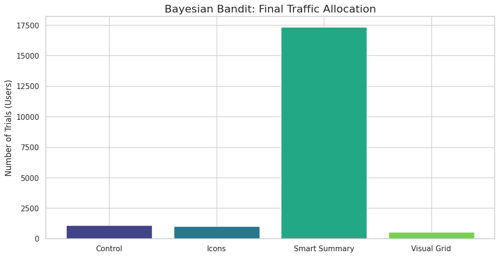
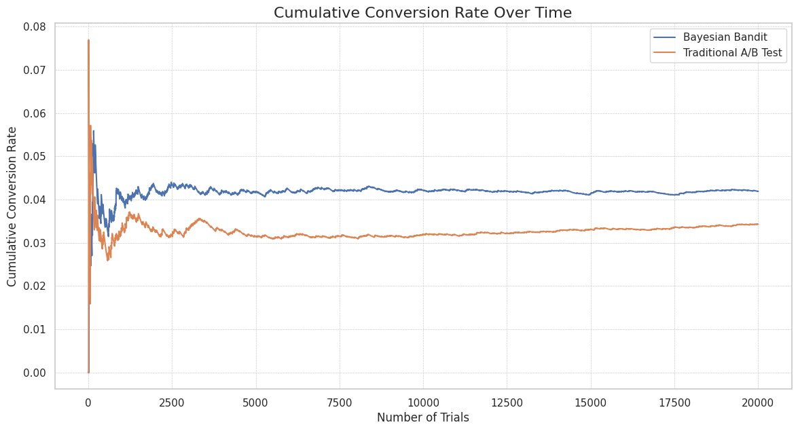
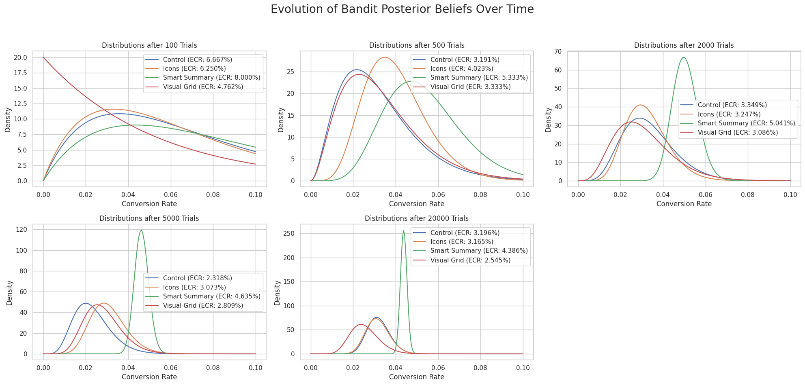

# Online-Experimentation-POC

# Bayesian Bandits for Online Experimentation

This project is a Python-based proof-of-concept demonstrating how a Bayesian multi-armed bandit algorithm (using Thompson Sampling) can be applied to online experimentation at a company like Airbnb. The simulation aims to find the best-performing UI variation while minimizing "regret" (i.e., lost bookings from showing users an inferior option).

## The Problem: The Explore-Exploit Dilemma

When testing new features, companies face a classic trade-off:
* **Explore:** Gather enough data on all variations to find the true winner.
* **Exploit:** Show the current best-performing variation to as many users as possible to maximize conversions.

A traditional A/B test explores for its entire duration. A multi-armed bandit, however, adaptively shifts traffic towards winning variations, balancing exploration and exploitation automatically.

## How It Works

This simulation models an experiment to optimize the "amenities" display on an Airbnb listing page.

1.  **Arms**: Each UI variation is an "arm" of the bandit (e.g., `Control`, `Icons`, `Smart Summary`).
2.  **Beliefs**: We use a **Beta distribution** to model our belief about the true booking rate of each arm.
3.  **Thompson Sampling**: For each simulated user, the algorithm:
    * Samples a plausible conversion rate from each arm's Beta distribution.
    * Shows the user the arm with the highest sample.
    * Updates the arm's Beta distribution based on whether the user "booked" (success) or not (failure).

## Results
The simulation shows the algorithm quickly identifying the "Smart Summary" variation as the winner. After an initial exploration phase, it allocates the vast majority of traffic to this winning arm.

#### Final Traffic Allocation


#### Conversion Rate Over Time


#### Learning Over Time


## How to Run This Project

1.  **Clone the repository:**
    ```bash
    git clone <your-repo-url>
    cd <your-repo-name>
    ```

2.  **Create a virtual environment (recommended):**
    ```bash
    python -m venv venv
    source venv/bin/activate  # On Windows use `venv\Scripts\activate`
    ```

3.  **Install the dependencies:**
    ```bash
    pip install -r requirements.txt
    ```

4.  **Run the script:**
    ```bash
    python Bayesbandits.py
    ```
    The script will run the simulation, print the final results to the console, and save the plots.

